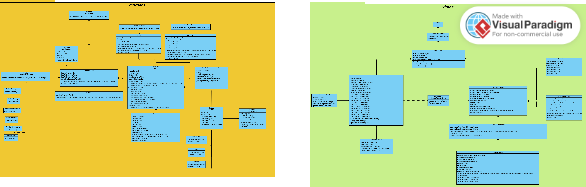
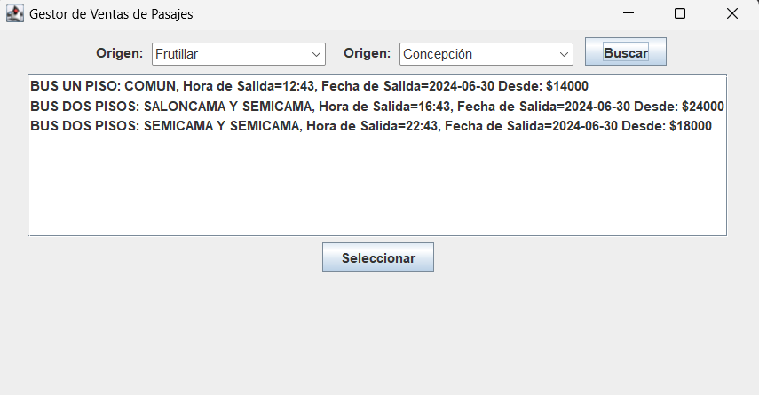
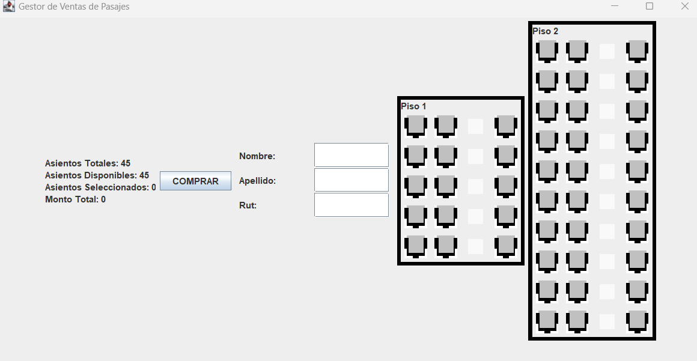

# Proyecto | Desarrollo Orientado a Objetos
### Tema 2: Sistema de reserva de asientos de autobús
### Grupo 1 Integrantes: 
 - Gabriel Sebastián Castillo Castillo
 - Marcos Emiliano Martínez Rojas
### Instrucciones de uso: 
Una vez teniendo clonado el repositorio: 
- Ejecutar el archivo Main.java que se encuentra en el package "vistas".
- Una vez abierta la primera "pestaña" deberá elegir localidad de origen y destino.
- Luego debe escoger un bus. 
- Posteriormente se dirigirá a la segunda "pestaña" donde podrá seleccionar los asientos que desee.
- Finalmente, rellenar con sus datos y esperar a que se confirme el pago. 
### Diagrama de clases UML:
### Diagrama de casos de uso: 
### Patrones de diseño utilizados:
-Patron Factory: Se utilizó en las clase BusFactory y las clases que la implementaron son DosPisosFactory y UnPisoFactory para crear los buses de dos pisos y de un piso respectivamente. Su implementacion fue en orden de simplificar
la creacion de los buses y para que el codigo sea mas legible.
-Patron Strategy: Se utilizó en la clase Estrategia recorrido y se implementó en todas las clases dentro de el paquete "viajes". Se utilizó para crear un arreglo de buses utilizando a su vez BusFactory,
de esta manera, al realizar la eleccion de un bus al momento de viajar, la cantidad y los tipos de buses pueden variar dependiendo del recorrido escogido, a su vez que 
se simplifica la creacion del arreglo de buses y el código queda más limpio y legible.
### Interfaz de usuario:
- Primera pestaña: 

- Segunda pestaña: 
### Toma de decisiones:
### Autocritica: 