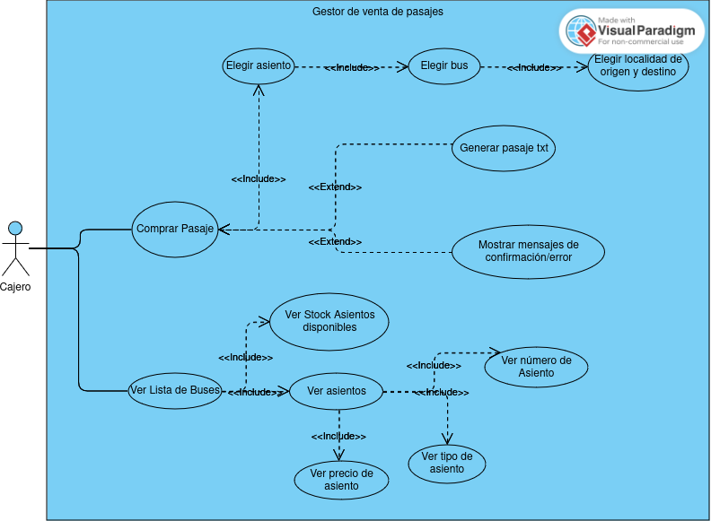
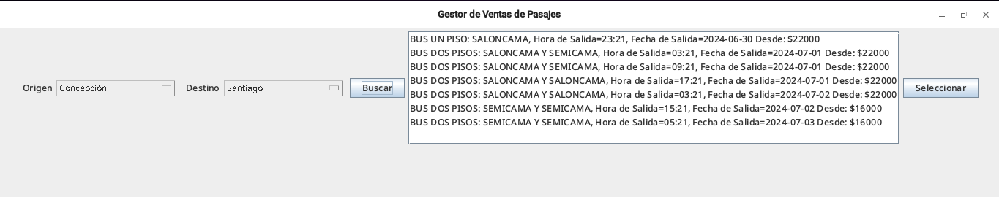
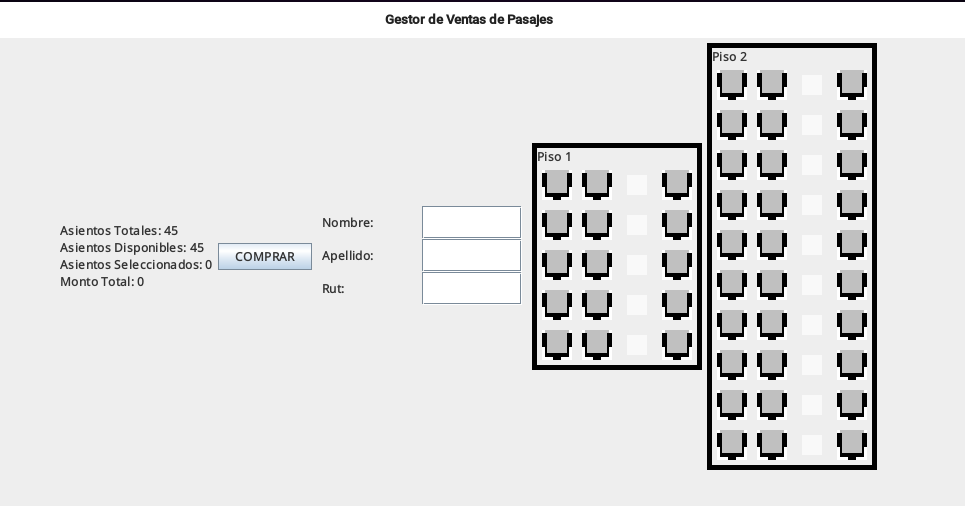

# Proyecto | Desarrollo Orientado a Objetos
### Tema 2: Sistema de reserva de asientos de autobús
### Grupo 1 Integrantes: 
 - Gabriel Sebastián Castillo Castillo
 - Marcos Emiliano Martínez Rojas

### Instrucciones de uso: 
Una vez teniendo clonado el repositorio: 
- Ejecutar el archivo Main.java que se encuentra en el package "vistas".
- Una vez abierta la primera "pestaña" deberá elegir localidad de origen y destino.
- Luego debe escoger un bus. 
- Posteriormente se dirigirá a la segunda "pestaña" donde podrá seleccionar los asientos que desee.
- Finalmente, rellenar con sus datos y esperar a que se confirme el pago.

### Diagrama de clases UML:
### Diagrama de casos de uso: 
### Patrones de diseño utilizados:
- Abstract Factory : Se creó la interfaz BusFactory y las clases que la implementaron
  son DosPisosFactory y UnPisoFactory para crear los buses de dos pisos y de un piso
  respectivamente. Su implementación fue en orden de simplificar
  la creación de los buses ya que debíamos implementar una diversa cantidad de estos, dependiendo del recorrido, además, para que el código sea más legible.

### Interfaz de usuario:
- Primera pestaña: 

- Segunda pestaña: 

### Toma de decisiones:
Desde un principio, acordamos como grupo empezar por el diagrama de casos de uso, para después pasar a
la creación del UML de las clases "lógicas", intentando que fuera
lo más completo posible. Una vez teniendo una estructura básica, comenzamos con la escritura de código y la creación del package "modelos",
lo fuimos desarrollando a profundidad y con cautelosidad. Es en esta etapa donde decidimos que lo mejor sería implementar el patrón de diseño
Abstract Factory para la creación de diversos tipos de buses (tanto en cantidad de pisos como en la variedad de asientos en él) en diferentes recorridos.
A medida que se creaban métodos complejos, realizábamos test unitarios.

Una vez finiquitando el package modelos, creamos una clase Main.java simulando un software sin interfaz gráfica donde se pueda evaluar cada una de las clases y métodos
creados.

Posteriormente, nos enfocamos en la creación del UML de las clases "gráficas", el procedimiento fué el mismo que para el package "modelos". Todas
las clases "gráficas" fueron almacenadas en el package "vistas".

Una idea creativa que implementamos después fue la creación de una clase que generará el pasaje en archivo.txt, simulando un pasaje real.

En la etapa final del proyecto, nos vimos enfrentados al desafío de lograr conectar "pestaña 1" con "pestaña 2", así surgió la clase PanelPrincipal, la cual tendría
como objetivo, moverse entre estas pestañas.

### Autocrítica:
El problema más significativo que nos sucedió, fue el cómo movernos entre dos pestañas
debido al nulo conocimiento que teníamos en ese momento. Es aquí donde estuvimos obstruidos más tiempo,
ya que tuvimos que invertir algunos días en investigar y aprender con códigos experimentales en otros archivos para saber cómo
aplicarlo a nuestro caso.

Con respecto al cómo diseñamos la creación de diversos recorridos, si bien es funcional, creemos que se puede optimizar
de una manera más profesional y eficiente implementado algún tipo de patrón, como el patrón Strategy. Intentamos implementar algo similar,
pero la clase que trabaja con la variable del tipo de la interfaz, EstrategiaRecorrido,
debía de cumplir con más objetivos/funcionalidades, por lo que dicha clase, CrearRecorrido, decidimos no modificarla.
 